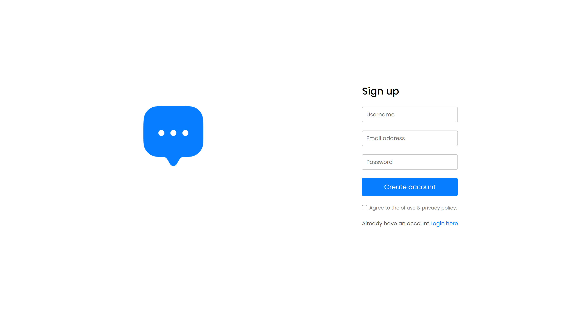
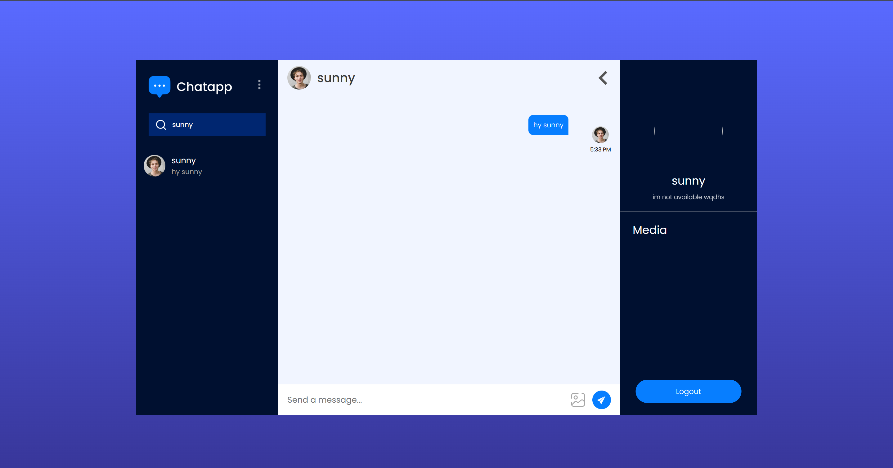

# 💬 Chat Application

<p align="center">
  
  
  
  
</p>

<p align="center">
  🚀 Real-time Chat Application built with React & Firebase  
</p>

---

## 🌐 Live Demo

👉 [https://chatapp-sunny.vercel.app/chat](https://chatapp-sunny.vercel.app/)

---

## ✨ Features

* 🔐 Authentication (Login / Signup)
* 💬 Real-time messaging
* 🖼️ Image sharing
* ⚡ Fast UI with Vite
* 📱 Responsive design

---

## 🛠️ Tech Stack

| Tech         | Usage           |
| ------------ | --------------- |
| React (Vite) | Frontend UI     |
| Firebase     | Auth + Database |
| Vercel       | Deployment      |
| GitHub       | Version Control |

---

## 🎥 Demo Preview

<p align="center">
  
  
</p>

---

## 📂 Project Structure

```
chat-app/
│── public/
│── src/
│   ├── components/
│   ├── pages/
│   ├── assets/
│   ├── context/
│   ├── config/
│── package.json
│── vite.config.js
```

---

## ⚙️ Setup

```bash
git clone https://github.com/sunnyguptaa12/chat-app.git
cd chat-app
npm install
npm run dev
```

---

## 🔐 Environment Variables

Create `.env` file:

```
VITE_FIREBASE_API_KEY=your_key
VITE_FIREBASE_AUTH_DOMAIN=your_domain
VITE_FIREBASE_PROJECT_ID=your_project_id
VITE_FIREBASE_STORAGE_BUCKET=your_bucket
VITE_FIREBASE_MESSAGING_SENDER_ID=your_sender_id
VITE_FIREBASE_APP_ID=your_app_id
```

---

## 🚀 Deployment

Deployed on **Vercel**
✔ Auto-deploy on every push

---

## 📈 Future Enhancements

* 🔔 Notifications
* ✍️ Typing indicator
* ❌ Delete messages
* 🌙 Dark mode

---

## 👨‍💻 Author

**Sunny Gupta**
🔗 https://github.com/sunnyguptaa12

---

## ⭐ Show your support

If you like this project, give it a ⭐ on GitHub!
